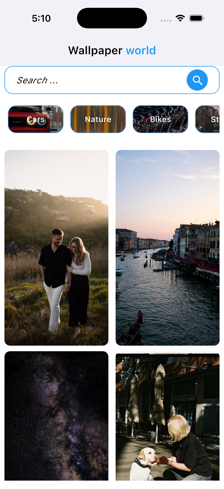
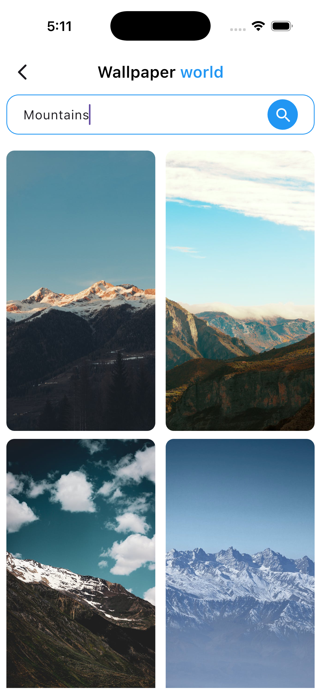
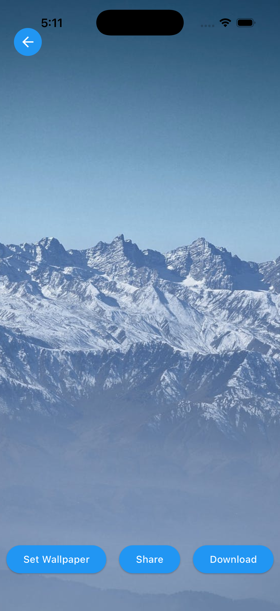
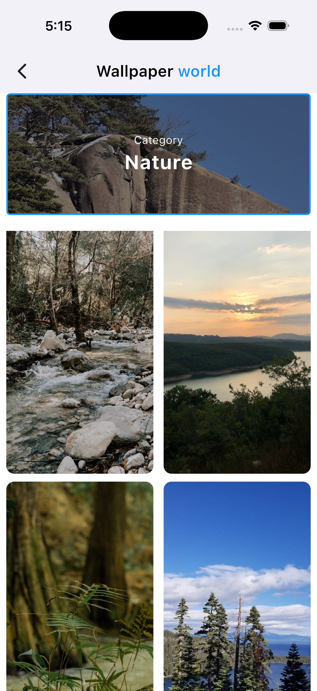

# 🖼️ Wallpaper World (Flutter)

A modern wallpaper browsing app built using Flutter, featuring high-quality wallpapers, smooth UI, and real-world functionality powered by the Pexels API.

---

## ✨ Overview

Wallpaper World is a mobile application that allows users to explore, search, and interact with high-quality wallpapers.

The app demonstrates clean UI design, API integration, and real-world features like downloading and applying wallpapers.

---

## 📱 Features

* 🖼️ Browse high-quality wallpapers
* 🔍 Search wallpapers using keywords
* 📂 Explore categories
* ⬇️ Download wallpapers to device
* 📤 Share wallpapers
* 🎯 Apply wallpapers (device-specific handling)
* ⚡ Smooth and responsive UI
* 🌐 API integration (Pexels)

---

## 📸 Screenshots

  
  
  
  

---

## 🎨 UI & Design

* Clean and minimal layout
* Focus on visual content
* Consistent spacing and styling
* Smooth scrolling and transitions

---

## 🛠 Tech Stack

* Flutter
* Dart
* REST API (Pexels API)
* HTTP/Dio (for API calls)

---

## 🚀 Purpose

This project focuses on:

* Building a real-world Flutter application
* Working with APIs and async data
* Creating smooth and modern UI
* Showcasing app development skills for clients

---

## 👨‍💻 Author

Rishab Sharma

---
